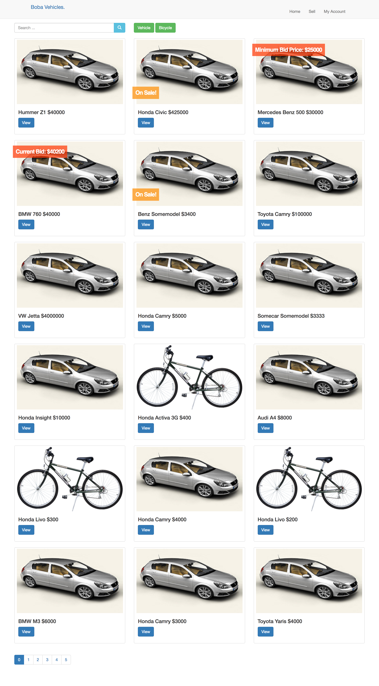
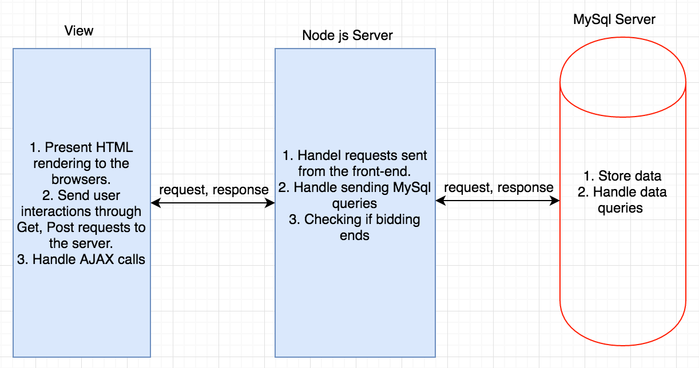
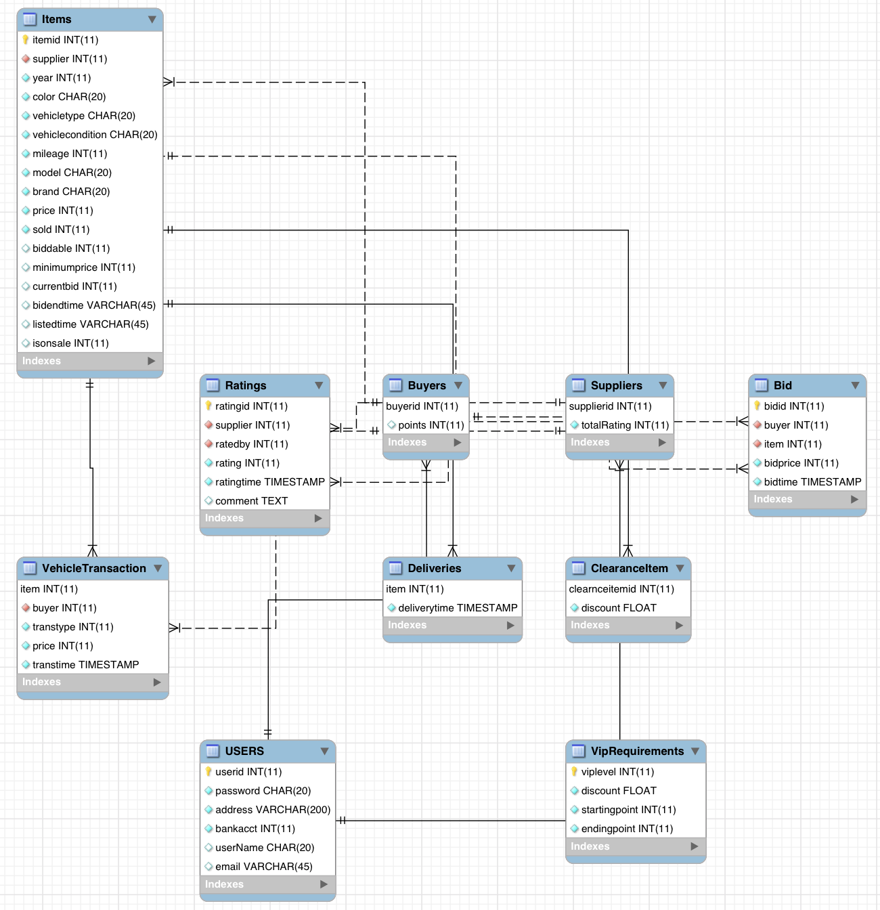
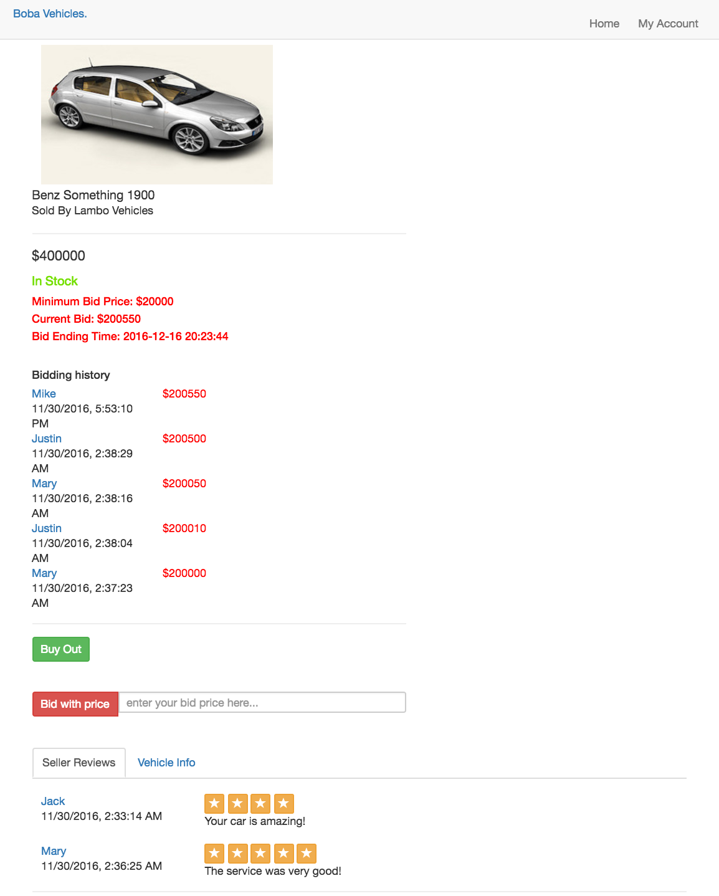
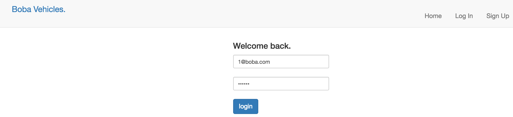
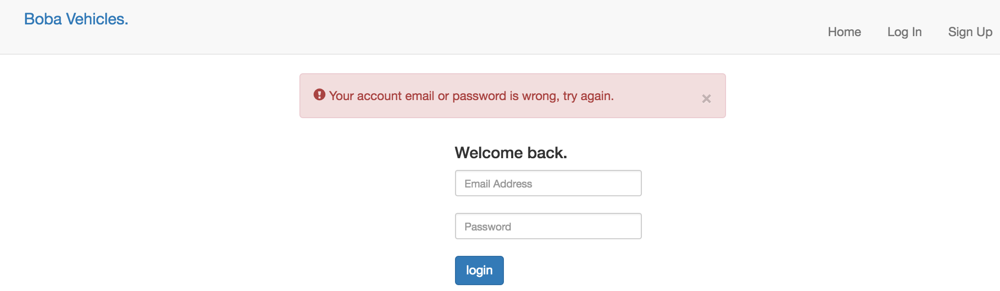
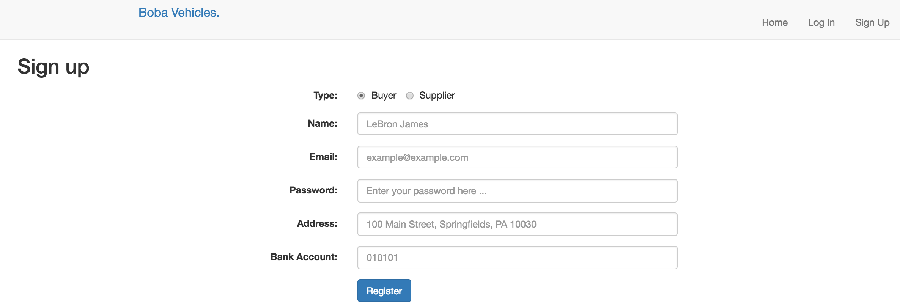
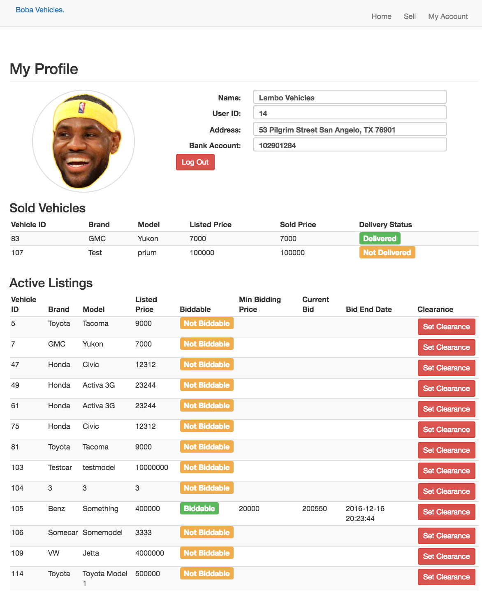
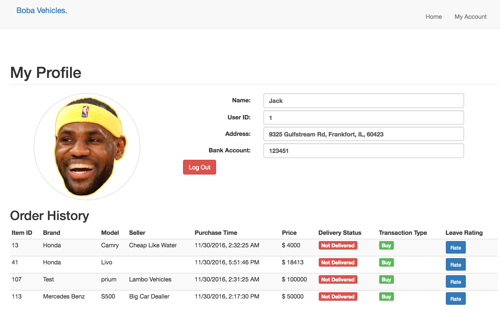
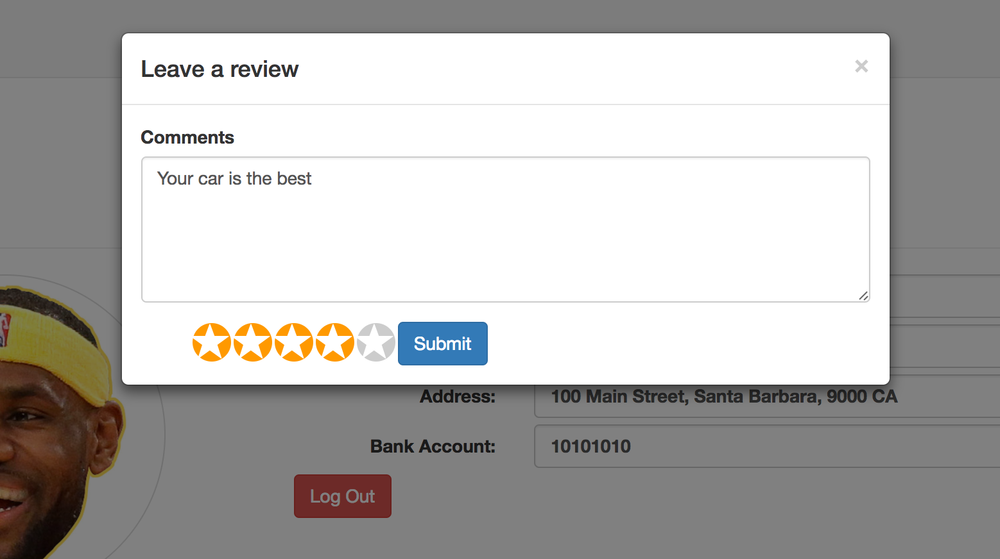

# Boba Vehicles
## A class project for CMPSC 431W, Fall 2017
  This is an eBay/Amazon-like project that provides a shopping platform. It supports buyer features such as **buying**, **selling**, **bidding** and **leaving rating**. Sellers will be able to post **fixed-price vehicles** and **biddable vechicles**.
  Click [here](https://drive.google.com/file/d/0B5wIrUFGxCPrM19sbi03c041MFE/view?usp=sharing) to view project report.
## Team Members and Tasks: 
- **Yuehui (Vincent) Wang**:
  * Website Development, Database Design, Report Writing
- **Zhouqian Jiang**:
  * Database Design, Report Writing
- **Chengwei Lin**:
  * Database Design, Report Writing
- **Yunqi Zhang**:
  * Database Design, Report Writing
- **Dikan Chen**:
  * Database Design, Report Writing
- **Jiaxin Liang**:
  * Database Design, Report Writing
  
## Project Details: 
**Website Home Page:** On the main page, people can view all of the vehicles actively listed on the website.

**Application Design:** As a web application, Boba is designed with the **MCV Architecture Method**. It has MySql Database that manages all of the data of users, vehicles and transactions. Node.js is used as the controller that defines the logic between backend and frontend. Express View Engine is used to deliver the contents to users.

**Database Design:** Relational Database that stores and manages information of users, vehicles and transactions.

**Item Page:** Users will be able to see more detailed information about the vehicle after clicking in. Details like ratings, vehicle description, seller, and bidding history will be shown on item page.

**Login And Registration:** Users are being broken down to two categories - Sellers and Buyers.
Login Page

Login Validation

User Registration

**Seller:** On seller acount page, seller can view the status of sold and un-sold vehicles. Seller can also set vehicles to be on-sale as Clearance items if wanted.
Seller Account Page

**Buyer:** On buyer account page, buyer can view the status of orders. Buyer can also leave ratings to previous orders.
Buyer Account Page

Buyer can leave rating

